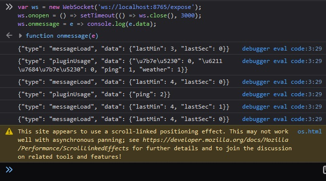
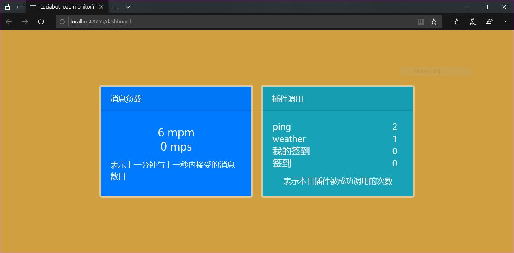

# 使用 NoneBot 和 go-cqhttp 搭建 QQ 群聊机器人

我们机器人的实用功能已经编写的差不多了。这一部试着来为 lucia 写一个简易的统计面板。由于仅是教程，此面板实现两个功能：
* 机器人实时处理的消息数目
* 命令触发的次数统计

由于 NoneBot 本身就是基于服务器运行的，这里可以让其暴露一些以上提及的 API，然后再让另一个页面（前端）来展示。

在这里我把提供统计的模块置于 `service` 文件夹。同时提供一个消息队列模块和一个 API 控制器。面板将使用 Websocket 连接到机器人的服务器，此时统计模块会源源不断地向此队列放入消息（广播），我们的 ws 端再从队列中提取消息发送给页面。

## 实现统计面板

### 队列

我们先从这个迷你消息队列说起。

创建 `luciabot/lucia/services/broadcast.py` 文件，包含如下的内容：
```py
import asyncio
from contextlib import contextmanager
from typing import Any, Awaitable, Callable, Dict, Generator, Set


# 约定所有通过队列的消息都要遵从此格式
# {
#   type: str,
#   data: { [k: string]: any },
# }
TPayload = Dict[str, Any]

# 目前存在的消息队列，一个客户（websocket 连接）对应着一个队列
# 键为队列，值为所监听的消息类型
_listeners: Dict[asyncio.Queue[TPayload], Set[str]] = {}


@contextmanager
def listen_to_broadcasts(*types: str) -> Generator[Callable[[], Awaitable[TPayload]], None, None]:
    'Returns a callable that when called, receives new messages.'
    queue = asyncio.Queue()
    _listeners[queue] = set(types)
    try:
        yield queue.get
    finally:
        _listeners.pop(queue)


async def broadcast(payload_lazy: Callable[[], Awaitable[TPayload]]):
    'Broadcast messages to all current subscribers.'
    if _listeners:
        payload = await payload_lazy()
        await asyncio.gather(*[
            queue.put(payload)
            for queue, types in _listeners.items()
            if payload['type'] in types
        ])
```
[Quart](https://pgjones.gitlab.io/quart/tutorials/websocket_tutorial.html) 官网建议使用装饰器实现订阅，在这里使用 with 也一样。这里包含第一个功能：当有新的客户端连接时，需要调用 `listen_to_broadcasts` 来生成对应的消息队列并返回给调用者，从此以后所有的广播都会传递到此队列，这时候只需要
```py
with listen_to_broadcasts('desired_msg_type') as get_msg:
    print( await get_msg() )
```
就可以及时的获取这条新消息。使用 with 确保了我们可以当不需要时候，及时移除队列。

同时模块还要提供另一个方法：`broadcast`，当有人需要广播消息时，只需要调用此方法把消息放入所有的队列中即可。要传递的参数是惰性求值的，因为当没有监听者的时候我们不需要传递任何信息。

这就是本模块的全部。

### 消息计数

消息计数的需求为：
* 统计过去 60 秒内机器人收到的消息数目
* 统计上一秒内机器人收到的消息数目

可以想到此功能需要每秒都运行。如果使用一个表示过去一分钟每一秒的消息数的数组的话，每当有一条消息被收到则对应数组计数加一，而每秒钟还要归零第 61 秒前的计数。过去 60 秒内的计数就是数组里数字的和。

`luciabot/lucia/services/inmsg_count.py` 的代码如下：
```py
import asyncio
from datetime import datetime
from typing import Optional

from .broadcast import TPayload, broadcast
from .log import logger


_counts = [0 for _ in range(61)]

_epoch = datetime.now()


def _get_offset() -> int:
    return int((datetime.now() - _epoch).total_seconds()) % 61


async def get_count(curr_s: Optional[int] = None) -> TPayload:
    'Gets report that counts number of messages received in last 60s and last second.'
    if curr_s is None:
        curr_s = _get_offset()
    return {
        'type': 'messageLoad',
        'data': {
            'lastMin': sum(_counts),
            'lastSec': _counts[curr_s - 1], # note [-1] indexes to [60]!
        },
    }


async def increase_now():
    _counts[_get_offset()] += 1


async def init():
    'Kickstarts the message counting service (removing old counts) and brocasting.'
    loop = asyncio.get_event_loop()
    def _service():
        curr_s = _get_offset()
        # 归零第 61 秒前的计数
        _counts[curr_s + 1 if curr_s != 60 else 0] = 0
        # 把计数消息广播出去，然后等一秒钟再继续这个循环
        # logger.info('reset')  # 取消试试
        asyncio.create_task(broadcast(lambda: get_count(curr_s)))
        loop.call_at(int(loop.time()) + 1, _service)

    _service()
    logger.info('Message load count loaded successfully!')
```

细节不过多考虑。这个模块有三个方法：`get_count` 用来主动获取数据，`increase_now` 用来将数组内当前秒数的数字加一，`init` 就像先前在数据库中看到的一样，产生一个清理 + 广播的定时任务。

Tip: 可以使用 [apscheduler](https://apscheduler.readthedocs.io/en/stable/) 库来实现此功能。

还有一个问题就是如何监听所有的消息？ `message_preprocessor` 装饰器可以解决这个问题。它可以在所有的命令处理器和自然语言处理器运行前先运行。本着服务和控制分离的原则，创建 `luciabot/lucia/bot_plugins/inmsg_count.py`，内容简单：
```py
from nonebot import message_preprocessor

from services import inmsg_count


__plugin_name__ = '消息计数 [Hidden]'


@message_preprocessor
async def _(bot, event, manager):
    await inmsg_count.increase_now()
```
只需要在接收消息的时候主动增加数组的内容即可。

然后同样要在程序入口处初始化这个服务。
`luciabot/lucia/bot.py`:
```py
# ...
from services import db_context, inmsg_count   # 添加此行
# ...
nonebot.on_startup(db_context.init)
nonebot.on_startup(inmsg_count.init)  # 添加此行
# ...
```

此时可以试着取消注释启动一下机器人，看看是否是在每一秒都打印了一条 `"reset"` 日志。

### 命令记录

这个功能可以按照上一个功能如法炮制，不过为了让机器人更有意思一些，此数据可以持久化一下，按照名字和日期分别存储。我们来用之前用到的数据库模组来实现这个目标。

首先依然创建相应的 Model 文件 `luciabot/lucia/models/command_use.py`。
```py
import datetime

from services.db_context import db


class CommandUse(db.Model):
    __tablename__ = 'command_uses'

    id = db.Column(db.Integer(), primary_key=True)
    name = db.Column(db.String(), nullable=False)
    date = db.Column(db.Date(), nullable=False)

    use_count = db.Column(db.Integer(), nullable=False)

    _idx1 = db.Index('command_uses_idx1', 'name', 'date', unique=True)

    @classmethod
    async def ensure(cls, name: str, date: datetime.date, for_update: bool = False) -> 'CommandUse':
        query = cls.query.where((cls.name == name) & (cls.date == date))
        if for_update:
            query = query.with_for_update()
        data = await query.gino.first()

        return data or await cls.create(
            name=name,
            date=date,
            use_count=0,
        )
```

又一个问题：为什么非得是 NoneBot 的“命令”记录呢？所谓命令处理器就是一个函数，我们仅仅需要记录这个函数被调用过多少次就够了。所以命令调用的模块只需要提供一个装饰器，在被装饰的函数成功执行完毕后写入数据就可以了。

这个模块有两个方法，一个用来主动获取 __全量__ 的调用统计，如下。

`luciabot/lucia/services/command_use_count.py`:
```py
import asyncio
import datetime
from functools import wraps
from typing import Awaitable, Callable, Dict, TypeVar

from .db_context import db
from .broadcast import TPayload, broadcast
from models.command_use import CommandUse


_base_count: Dict[str, int] = {}


async def get_count() -> TPayload:
    'Gets all command use counts from the database for today.'
    today = datetime.datetime.today().date()
    re = await CommandUse \
        .select('name', 'use_count') \
        .where(CommandUse.date == today) \
        .gino.all()
    return {
        'type': 'pluginUsage',
        'data': _base_count | { pair['name']: pair['use_count'] for pair in re }
    }
```
其中 `_base_count` 用来记录所有的命令名字（和其初始值 0）。当本日命令没有被调用时，上面的查询不会返回结果，所以我们需要这个信息兜底。

这是装饰器：
```py
async def _get_count_incremental(usedata: CommandUse) -> TPayload:
    return {
        'type': 'pluginUsage',
        'data': { usedata.name: usedata.use_count }
    }


_TAsyncFunction = TypeVar('_TAsyncFunction', bound=Callable[..., Awaitable])


def record_successful_invocation(keyname: str):
    '''When the wrapped function exits, its today\'s use count is incremented and message
    is broadcasted.
    '''
    _base_count[keyname] = 0

    async def _post_invocation():
        # 记录调用
        today = datetime.datetime.today().date()
        async with db.transaction():
            usedata = await CommandUse.ensure(keyname, today, for_update=True)
            await usedata.update(use_count=usedata.use_count + 1).apply()
        # 仅广播增量信息！
        await broadcast(lambda: _get_count_incremental(usedata))

    def decorator(f: _TAsyncFunction) -> _TAsyncFunction:
        @wraps(f)
        async def wrapped(*args, **kwargs):
            # 运行要调用被装饰的命令处理器
            result = await f(*args, **kwargs)
            # 然后做记录
            asyncio.create_task(_post_invocation())
            return result
        return wrapped

    return decorator
```
每当被装饰的函数返回的时候，相应的数据库行会被写入，同时我们会广播只和当前事件有关联的 __增量__ 消息！

这代表着我们必须要先调用 `get_count` 获取全部的命令信息，然后才能依赖这些广播消息，这一点和上一个功能不同。这是为了节省一些查询和流量。

要使用这个模块不需要 `init` 函数。以最开始介绍过的 `ping` 命令为例，将 `luciabot/lucia/bot_plugins/ping.py` 修改成如下的样子：
```py
# ...
from services.command_use_count import record_successful_invocation

# ...

@on_command('ping', permission=lambda sender: sender.is_superuser)
@record_successful_invocation('ping')  # 命令名 - 或者是任何表示名字的字符串
async def _(session: CommandSession):
    await session.send('pong!')
```
就可以了！每当这个命令完成时，信息就会广播。它和如下片段的效果一致：
```py
@on_command(...)
async def _(session: CommandSession):
    await session.send('pong!')
    asyncio.create_task(_post_invocation())
```


剩余的天气和签到命令也一样。

### 添加路由
按照 Quart 的教程，创建文件 `luciabot/lucia/controllers.py` 内容如下。
```py
import json
from quart import Quart, websocket, send_file

from service_config import RESOURCES_DIR
from services import command_use_count, inmsg_count
from services.broadcast import listen_to_broadcasts


def add_controllers(app: Quart):

    @app.route('/dashboard', ['GET'])
    async def _dashboard_get():
        # 这个文件现在还没创建，一会儿再说
        return await send_file(f'{RESOURCES_DIR}/dashboard.html')

    @app.websocket('/expose')
    async def _expose_ws():
        # 主动调用 API，填充完整的命令调用信息 (bootstrap)
        await websocket.send(json.dumps(await inmsg_count.get_count()))
        await websocket.send(json.dumps(await command_use_count.get_count()))
        # 然后再接入消息队列被动获取信息
        with listen_to_broadcasts('messageLoad', 'pluginUsage') as get:
            while True:
                payload = await get()
                await websocket.send(json.dumps(payload))
```
在这里暴露了一个 ws 接口，当客户端链接的时候首先推送上面两个全量的统计信息，然后再接入消息队列，当有消息的时候推送给客户端。

不要忘了仍然在主程序入口调用此初始化函数：
```py
from controllers import add_controllers   # 添加此行
# ...
bot = nonebot.get_bot()
app = bot.asgi

add_controllers(bot.server_app)   # 添加此行
# ...
```

输入 `docker-compose build && docker-compose up` 运行机器人。此时应该所有的服务都已经加载好了。

打开浏览器控制台，创建一个 ws 连接，地址为 `ws://你的网络地址:机器人暴露的端口/expose`，并且设定好 3 秒中后关闭。

在关闭连接前用你最快的速度给机器人发一条 `ping` 命令！结果应该如下所示：



可以看到最开始的两条消息分别是负载统计和命令调用信息。注意后者是全量的（而且注意中文字符这里被转义了）。然后我突然调用了一次 `ping` 命令，这导致有一条增量的 `"pluginUsage"` 消息被推送，显示计数从 1 变成了 2. 随后每秒都在运行的负载统计的结果告诉我上一秒的处理消息数目为 1，又过了一秒钟这个数字掉回 0.

### React 面板

最后再创建相应的面板。所谓的前端就是一个 html 文件。创建 `luciabot/lucia/resources/dashboard.html`，添加以下的框架：
```html
<!DOCTYPE html>
<html lang="en">
<head>
  <meta charset="UTF-8">
  <meta name="viewport" content="width=device-width, initial-scale=1.0">
  <meta http-equiv="X-UA-Compatible" content="ie=edge">
  <title>Luciabot load monitoring</title>
  <link href="https://maxcdn.bootstrapcdn.com/bootstrap/4.5.0/css/bootstrap.min.css" rel="stylesheet" integrity="sha384-9aIt2nRpC12Uk9gS9baDl411NQApFmC26EwAOH8WgZl5MYYxFfc+NcPb1dKGj7Sk" crossorigin="anonymous"/>
</head>
<style>
  html, body { background-color: #cf9f40; }
</style>
<body>
  <div id="root"></div>
  <script crossorigin src="https://unpkg.com/react@17/umd/react.development.js"></script>
  <script crossorigin src="https://unpkg.com/react-dom@17/umd/react-dom.development.js"></script>
  <script crossorigin src="https://unpkg.com/react-bootstrap@1.1.0-rc.0/dist/react-bootstrap.js"></script>
  <script crossorigin src="https://unpkg.com/babel-standalone@6/babel.min.js"></script>
  <script type="text/babel">
    <!--这里是 jsx 代码-->
  </script>
</body>
</html>

```
在这里为了简单直接引用的 babel 的 cdn 在 html 文件里写 JavaScript。React 代码很简单，本教程的面板如下：
```js
const Container = ReactBootstrap.Container;
const Row = ReactBootstrap.Row;
const Card = ReactBootstrap.Card;

const MyCard = p => (
  <Card bg={p.bg} text="light" className="m-2"
        style={{ minWidth: '30vw', minHeight: '30vh', borderWidth: '3px', borderColor: '#e0c795' }}
  >
    <Card.Header>{p.header}</Card.Header>
    <Card.Body className="d-flex align-items-center justify-content-center flex-column">
      <Card.Title className="w-100 text-center" style={{ fontSize: '1.5rem' }}>
        {p.children}
      </Card.Title>
      <Card.Text>{p.desc}</Card.Text>
    </Card.Body>
  </Card>
);

const MessageLoad = p => (
  <MyCard bg="primary" header="消息负载" desc="表示上一分钟与上一秒内接受的消息数目">
    {p.data !== null ?
      <span>{p.data.lastMin} mpm <br /> {p.data.lastSec} mps</span>
    : 'Loading'}
  </MyCard>
);

const PluginUsage = p => (
  <MyCard bg="info" header="插件调用" desc="表示本日插件被成功调用的次数">
    {p.data !== null ?
      <table className="w-100" style={{ fontSize: '1.2rem' }}>
        <tbody>
          {Array.from(Object.keys(p.data).sort(),
            name => (
              <tr key={name} className="text-light">
                <td className="text-left">{name}</td>
                <td className="text-center">{p.data[name]}</td>
              </tr>
            )
          )}
        </tbody>
      </table>
    : 'Loading'}
  </MyCard>
);

const Dashboard = () => {
  const [ signal, redo ] = React.useReducer(prev => prev + 1, 0);
  const [ messageLoad, setMessageLoad ] = React.useState(null);
  const [ pluginUsage, incPluginUsage ] = React.useReducer((prev, inc) =>
    // 除了第一次之后接收的都是增量信息
    prev === null ? inc : {...prev, ...inc}, null
  );

  React.useEffect(() => {
    const uri = new URL('/expose', window.location.href);
    uri.protocol = uri.protocol.replace('http', 'ws');
    const ws = new WebSocket(uri.toString());

    ws.onopen = () => console.log('Connected to lucia.');

    ws.onclose = () => {
      console.warn('Connection to lucia dropped. Prepare to retry...');
      setTimeout(redo, 5000);
    };

    ws.onmessage = e => {
      const payload = JSON.parse(e.data);
      if (payload.type === 'messageLoad')
        setMessageLoad(payload.data);
      else if (payload.type === 'pluginUsage')
        incPluginUsage(payload.data);
    };

    return () => ws.close();
  }, [signal]);

  return (
    <Container className="d-flex align-items-center justify-content-center vh-100">
      <Row md={3} className="d-flex justify-content-center">
        <MessageLoad data={messageLoad} />
        <PluginUsage data={pluginUsage} />
      </Row>
    </Container>
  );
};

ReactDOM.render(
  <Dashboard />, document.querySelector('#root')
);
```

最后启动机器人，在浏览器中输入 `地址:端口/dashboard`，可以看到效果如下。



恭喜！我们的机器人现在已经有了 1. API 调用功能，2. 持久存储功能，3. 监控功能。此时 lucia 目录的结构应该如下所示：
```
lucia
├── Dockerfile
├── bot.py
├── bot_config.py
├── bot_plugins/
│   ├── group_user_checkin.py
│   ├── inmsg_count.py
│   ├── ping.py
│   └── weather.py
├── controllers.py
├── models/
│   ├── command_use.py
│   └── group_user.py
├── requirements.txt
├── resources/
│   ├── SourceHanSans-Regular.otf
│   ├── dashboard.html
│   └── group_user_check_bg.png
├── service_config.py
└── services/
    ├── broadcast.py
    ├── command_use_count.py
    ├── common.py
    ├── db_context.py
    ├── group_user_checkin.py
    ├── inmsg_count.py
    ├── log.py
    ├── processpool.py
    └── weather.py
```

### 考虑异步
因为 NoneBot 所有的功能全都是依赖于异步 IO 的，所以在机器人代码中放入耗时的同步代码是一件很危险的事情。因为本教程中引入了定时任务，如果同步代码阻塞了主循环，会造成任务调用的不准时。所以一般有两个选择：使用异步库（例如 gino），或者把任务分派到其他线程/进程（例如上一篇中的 Pillow）。

有了这个消息队列机制，不仅可以实现上面提及的两个功能，还可以复用这个模块来实现更多的特性。

## grouptty

这次来试着实现一个比较有意思的功能，群消息转发。此功能需要超级用户手动开启，当开启后用户与机器人的聊天窗口就变成了一个 `"tty"`，在此期间该群的聊天会被机器人转发到该聊天。用户可以对机器人说任意话，而后者会转发给该群。

这个插件就要依赖消息的机制，每当有新的群消息来到时要推到队列中，只不过这一次的“客户端”不是 ws 了，而是 NoneBot 与超级用户的私聊。


首先我们来用 `message_preprocessor` 捕获所有的群聊消息：

`luciabot/lucia/bot_plugins/grouptty.py`
```py
# 一大堆 import
import asyncio
from typing import Dict, Tuple
from nonebot import message_preprocessor
from nonebot.message import CQEvent
from nonebot.command import CommandSession
from nonebot.helpers import context_id
from nonebot.exceptions import CQHttpError
from nonebot.experimental.plugin import on_command

from services.command_use_count import record_successful_invocation
from services.broadcast import broadcast, listen_to_broadcasts, TPayload


__plugin_name__ = 'grouptty'
__plugin_usage__ = (
    '用法：对我说 "grouptty" 查看当前的 tty 信息。\n'
    '对我说 "grouptty [群号]" 接入该群聊天。\n'
    '在此期间该群的聊天会被我转发到这里。\n'
    '你可以说 "grouptty.send [消息]" 来向此群发送消息。\n'
    '期间发送 "grouptty.end" 结束当前 tty。'
)


# 收到群聊消息时要广播一下
# 没错我们可以定义多个消息预处理器
@message_preprocessor
async def _(bot, event: CQEvent, manager):
    if not event.group_id:
        return

    async def _bc() -> TPayload:
        return {
            # 订阅的群组
            'type': f'grouptty-{event.group_id}',
            'data': {
                'message': event.message,
                'user_id': event.user_id,
                'name': event.sender['card'] or event.sender['nickname'],
            },
        }

    asyncio.create_task(broadcast(_bc))
```

像刚才的消息计数一样这是很平常的消息预处理器。当群消息来到时我们动态生成一个 `"type"` 字段来避免和别的种类消息混淆。这里的 `"type"` 字段为群号。

这是首个本教程中稍微复杂的插件例子。如同上面代码中的注释所讲，它有 3 个子命令，分别为 `grouptty`, `grouptty.end` 和 `grouptty.send`。前两个子命令的实现如下：
```py
# ...

grouptty_permission = lambda sender: sender.is_superuser

# tty 发起者的 context（即 qq 号码 + 发起者群号（如果有）生成的唯一 ID） 值为相应的群号和从广播提取消息的循环
_ttys: Dict[str, Tuple[int, asyncio.Task]] = {}


@on_command('grouptty', permission=grouptty_permission)
@record_successful_invocation('grouptty')
async def _(session: CommandSession):
    # 如果用户已经有一个链接，就提示
    if (pair := _ttys.get(context_id(session.event))) is not None:
        await session.send(f'grouptty: 目前已经在监听群 {pair[0]}')
        return

    bot, event = session.bot, session.event
    group: str = session.current_arg_text.strip()
    # 如果用户不提供群号，就发送机器人所在的群列表
    if not group:
        available_groups = await bot.get_group_list()
        await session.send(
            'grouptty: 可以监听的群: ' +
            ', '.join(f"{g['group_id']}" for g in available_groups)
        )
        return

    async def _receive():
        # 订阅的群组
        with listen_to_broadcasts(f'grouptty-{group}') as get:
            while True:
                ev = (await get())['data']
                # 转发消息给当前会话
                await bot.send(event, f'grouptty: {ev["user_id"]} ({ev["name"]}): {ev["message"]}')

    _ttys[context_id(session.event)] = (int(group), asyncio.create_task(_receive()))
    await session.send('grouptty: 开始')


@on_command(('grouptty', 'end'), permission=grouptty_permission)
async def _(session: CommandSession):
    if (pair := _ttys.pop(context_id(session.event), None)) is not None:
        pair[1].cancel()
        await session.send('grouptty: 结束')
    else:
        await session.send('grouptty: 当前没有接入群聊！')
```

在这里注意几点：
* 代码使用了一个全局变量来追踪用户和其对应的 tty session。当用户开始新连接时，我们就创建一个死循环执行类似以往的从队列中提取消息的任务。当用户想要停止时，我们就结束它。
* 我给 `on_command` 中传递了一个元组，这代表给命令起了一个前缀。
* `context_id` 用来计算一个代表发送者身份的 ID。这表示每一个发送者只能接入一个 tty。

这是主动向群聊发送消息的命令：
```py
# ...

@on_command(('grouptty', 'send'), permission=grouptty_permission)
@record_successful_invocation('grouptty.send')
async def _(session: CommandSession):
    if (pair := _ttys.get(context_id(session.event))) is not None:
        msg = session.current_arg or await session.aget(prompt='grouptty>')
        try:
            await session.bot.send_group_msg(group_id=pair[0], message=msg)
        except CQHttpError:
            await session.send('grouptty: 发送失败！')
    else:
        await session.send('grouptty: 当前没有接入群聊！')
```

在这个例子里，`session.bot` 也可以获取 `NoneBot` 的单例。形如 `weather` 命令一样，我们向用户接收参数，此参数会被当作消息发送给目标的群聊。

注意到这个插件里我也用到了上面定义的计数用装饰器。

打开 `luciabot/lucia/bot_config.py`，添加如下的配置项：
```py
# ...

# 当命令名为元组时，使用如下的分隔符来分割命令。
COMMAND_SEP = { '.' }

# ...
```

运行机器人，看一下它的效果：

我与 lucia 的私聊
```
我:
  grouptty
lucia:
  grouptty: 可以监听的群: 12345678, 87654321
我:
  grouptty 12345678
lucia:
  grouptty: 开始
我:
  grouptty.send 有人吗
lucia:
  grouptty: 123456789 (person a): 有人
lucia:
  grouptty: 1234567890 (misaka mikoto): 何か
我:
  grouptty
lucia:
  grouptty: 目前已经在监听群 12345678
我:
  ping
lucia:
  pong!
我:
  grouptty.end
lucia:
  grouptty: 结束
```

群 12345678 的聊天记录
```
lucia:
  有人吗
person a:
  有人
misaka mikoto:
  何か
```

（其中群号与 qq 号均为示例）

一定要记得不用的时候使用 `grouptty.end` 停止监控！

在这里为了展示我们转发的是群信息，在其他应用里我们可以转发诸如服务器的 systemd，其他平台的聊天记录等信息。
